<h1 align = "center">实验报告：基于双层ReLU神经网络的函数近似</h1>

# 一、函数定义

本实验旨在验证两层ReLU激活函数的神经网络对任意函数的拟合能力。为此，我们定义了以下目标函数：
$$
f(x)=\sin(x)+0.5 \cdot x
$$
该函数是一个非线性函数，包含了正弦函数和线性函数的组合，具有显著的非线性特点，非常适合用来测试神经网络的拟合能力。

# 二、数据采集

我们选择在区间 $[-5, 5]$ 内均匀采样1000个数据点，得到输入值 $x$，然后通过目标函数计算输出值 $f(x)$，即每个数据点都有一个对应的目标值。

数据集被随机分为训练集和测试集，80%的数据（即800个数据点）用于训练神经网络，剩下的20%（即200个数据点）用来评估模型的泛化性能和拟合效果。

# 三、模型描述

## 1. 网络结构

我们使用了PyTorch框架来构建神经网络。具体的网络结构如下：

| 层类型    | 输入维度 | 输出维度 | 激活函数 |
| :-------- | :------- | :------- | :------- |
| 全连接层1 | 1        | 64       | ReLU     |
| 全连接层2 | 64       | 64       | ReLU     |
| 输出层    | 64       | 1        | 无       |

## 2.模型示意图

模型的训练使用了Adam优化器，损失函数采用均方误差（MSE），学习率为0.001，训练周期为500轮。通过反向传播算法，优化神经网络的权重，使其逐渐逼近目标函数。

```mermaid
%% 精确高度控制方案
flowchart TB
    subgraph 前向传播[ ]
        direction LR
        in[输入\nx]:::input -->|W₁| fc1[全连接层1] -->|ReLU| fc2[全连接层2] -->|ReLU| out[输出\nŷ]:::output
    end
    
    subgraph 反向传播[ ]
        direction LR
        out -->|∇ŷ| g3[∇W₃]:::grad
        fc2 -->|∇a₂| g2[∇W₂]:::grad
        fc1 -->|∇a₁| g1[∇W₁]:::grad
    end

    classDef default fill:#1a1a1a,stroke:#666,color:#eee,stroke-width:1px
    classDef input fill:#2a1a2a,stroke:#c88
    classDef output fill:#1a2a1a,stroke:#8c8
    classDef grad fill:#3a1111,stroke:#f44
```




## 3.关键参数配置

|   组件   |       配置详情       |
| :------: | :------------------: |
| 损失函数 |   均方误差（MSE）    |
|  优化器  | Adam（学习率=0.001） |
| 训练轮次 |      500 epochs      |
|  批大小  |      全批量训练      |

# 四、拟合效果

## 1.测试结果

程序运行结果：

<div>			<!--块级封装-->
    <center>	<!--将图片和文字居中-->
    
    <br>		<!--换行-->
    运行结果	<!--标题-->
    </center>
</div>

```
Epoch [50/500], 损失: 0.2158
Epoch [100/500], 损失: 0.0296
Epoch [150/500], 损失: 0.0058
Epoch [200/500], 损失: 0.0049
Epoch [250/500], 损失: 0.0047
Epoch [300/500], 损失: 0.0046
Epoch [350/500], 损失: 0.0045
Epoch [400/500], 损失: 0.0043
Epoch [450/500], 损失: 0.0042
Epoch [500/500], 损失: 0.0040
测试集最终损失值: 0.0044
```


## 2.训练过程分析

<div>			<!--块级封装-->
    <center>	<!--将图片和文字居中-->
    
    <br>		<!--换行-->
    训练损失曲线	<!--标题-->
    </center>
</div>

- **收敛趋势**：损失从初始值1.4快速下降至0.0040
- **关键节点**：
  - Epoch 100：损失0.0296（进入稳定下降阶段）
  - Epoch 300：损失0.0046（接近收敛）

## 3.可视化对比

<div>			<!--块级封装-->
    <center>	<!--将图片和文字居中-->
    
    <br>		<!--换行-->
    拟合曲线	<!--标题-->
    </center>
</div>

- **主要区间（-4≤x≤4）**：预测曲线（红色虚线）与真实曲线（蓝色实线）基本重合
- **边界区域（|x|>4）**：出现可见偏差（最大误差点x=4.87）

## 4.结果分析

综上所述，本实验验证了两层ReLU激活神经网络在非线性函数拟合方面的强大能力。实验结果与理论预期一致，充分证明了神经网络的强泛化能力和通用函数逼近能力。

****

# 附录

源代码：

```python
# -*- coding: utf-8 -*-
import torch
import torch.nn as nn
import torch.optim as optim
import numpy as np
import matplotlib.pyplot as plt
from sklearn.model_selection import train_test_split

plt.rcParams['font.sans-serif'] = ['SimHei']  # 使用SimHei字体
plt.rcParams['axes.unicode_minus'] = False  # 解决负号显示为方块的问题

# 步骤1: 定义目标函数
def target_function(input_x):
  """目标函数：sin(x) + 0.5x"""
  return np.sin(input_x) + 0.5 * input_x


# 步骤2: 生成数据集（训练集和测试集）
# 生成1000个在[-5, 5]区间均匀分布的数据点
x_values = np.linspace(-5, 5, 1000).reshape(-1, 1)  # 1000 points in range [-5, 5]
y_values = target_function(x_values)

# 将NumPy数组转换为PyTorch张量
x_tensor = torch.tensor(x_values, dtype=torch.float32)
y_tensor = torch.tensor(y_values, dtype=torch.float32)

# 将数据分割为训练集和测试集（80%训练，20%测试）
x_train, x_test, y_train, y_test = train_test_split(x_tensor, y_tensor, test_size=0.2, random_state=42)


# 步骤3: 构建神经网络模型(2-layer ReLU)
class NeuralNet(nn.Module):
  def __init__(self):
    """神经网络结构定义"""
    super(NeuralNet, self).__init__()
    self.layer1 = nn.Linear(1, 64)  # 输入层（1个特征）到第一隐藏层（64个神经元）
    self.layer2 = nn.Linear(64, 64)  # 第一隐藏层到第二隐藏层
    self.output_layer = nn.Linear(64, 1)   # 第二隐藏层到输出层（1个输出）

    def forward(self, x):
      x = torch.relu(self.layer1(x))  # 第一层使用ReLU激活
      x = torch.relu(self.layer2(x))  # 第二层使用ReLU激活
      x = self.output_layer(x)  # 输出层不使用激活函数（回归任务）
      return x


    # 初始化模型、损失函数和优化器
    model = NeuralNet()
    criterion = nn.MSELoss()
    optimizer = optim.Adam(model.parameters(), lr=0.001)

    # 步骤4: 训练模型
    num_epochs = 500
    loss_history = []
    for epoch in range(num_epochs):
      model.train()  # 设置模型为训练模式

      # 前向传播
      outputs = model(x_train)
      loss = criterion(outputs, y_train) # 计算损失

      # 反向传播和优化
      optimizer.zero_grad()
      loss.backward()
      optimizer.step()

      loss_history.append(loss.item())

      # 每50轮打印损失值
      if (epoch + 1) % 50 == 0:
        print(f'Epoch [{epoch + 1}/{num_epochs}], 损失: {loss.item():.4f}')


        # 步骤5: 评估模型
        model.eval()  # 设置模型为评估(evaluation mode)模式（关闭dropout等训练专用层）
        with torch.no_grad():# 禁用梯度计算以提升效率
          y_pred = model(x_test)

          # Step 6: Plot the results
          plt.figure(figsize=(10, 6))
          plt.plot(x_test.numpy(), y_test.numpy(), label='真实值', color='blue', alpha=0.5)
          plt.scatter(x_test.numpy(), y_pred.numpy(), label='预测值', color='red', alpha=0.5, marker='x')
          plt.title("使用2层ReLU神经网络进行函数近似")
          plt.xlabel("x")
          plt.ylabel("f(x)")
          plt.legend()
          plt.grid(True)
          plt.show()

          # 绘制训练损失曲线
          plt.figure(figsize=(10, 6))
          plt.plot(loss_history, label='训练损失', color='green')
          plt.title("训练损失曲线")
          plt.xlabel("Epoch")
          plt.ylabel("Loss")
          plt.legend()
          plt.grid(True)
          plt.show()

          # Print the final loss value
          loss = criterion(y_pred, y_test)
          #print(f"Final test loss: {loss.item():.4f}")
          print(f"测试集最终损失值: {loss.item():.4f}")
```

