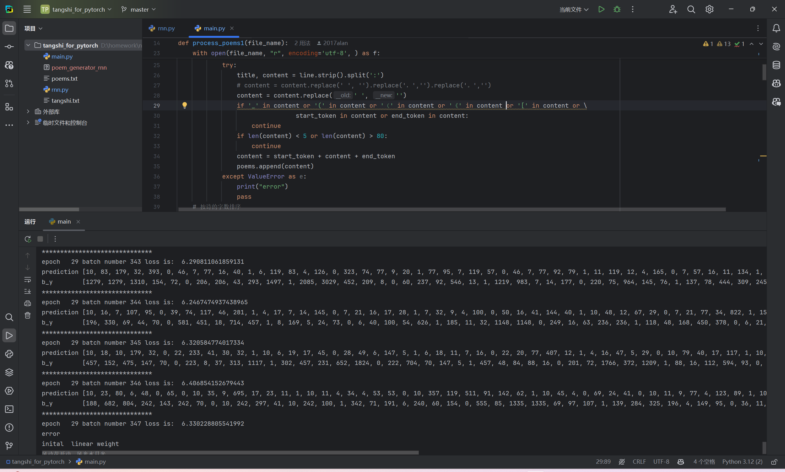
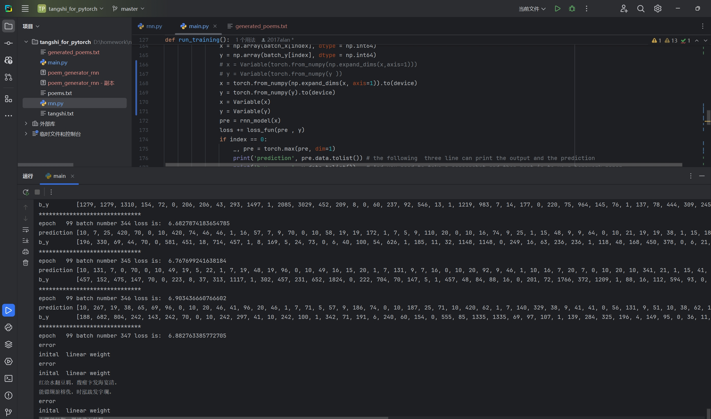

# 一、解释一下 RNN ，LSTM，GRU模型

## 1.循环神经网络 (Recurrent Neural Network, RNN)

- **核心思想：** RNN 的设计初衷是为了处理序列信息。与传统的前馈神经网络（认为所有输入/输出是相互独立的）不同，RNN 引入了“记忆”的概念。它通过在网络内部建立一个“循环”（Loop）结构，使得当前时间步的输出不仅依赖于当前的输入，还依赖于之前时间步处理过的信息。
- **工作机制：**
  - 在每个时间步 t，RNN 接收当前输入 x_t 和来自上一个时间步的隐藏状态 h_{t-1}。
  - 它使用**相同的**一组权重（这很关键，体现了参数共享，使模型能处理不同长度的序列）来计算当前的隐藏状态 h_t 和当前时间步的输出 y_t。
  - 计算公式大致为：
    - $h_t = tanh(W_{hh} * h_{t-1} + W_xh * x_t + b_h) $（计算新的隐藏状态）
    - $y_t = W_{hy} * h_t + b_y $（计算当前输出）
    - 其中 $W_{hh},$ $W_{xh}$, $W_{hy}$ 是权重矩阵，$b_h$, $b_y $是偏置项，$tanh $是常用的激活函数。
  - 隐藏状态 $h_t $就像是网络在时间步 t 的“记忆”，它会传递给下一个时间步 t+1。
- **优点：**
  - 理论上能处理任意长度的序列。
  - 参数共享，模型更紧凑。
  - 能够捕捉序列中的短期依赖关系。
- **缺点（非常重要）：**
  - **梯度消失/爆炸 (Vanishing/Exploding Gradients)：** 在训练过程中，当序列很长时，通过时间反向传播（Backpropagation Through Time, BPTT）计算梯度时，梯度可能会随着时间步的增加而指数级地缩小（梯度消失）或增大（梯度爆炸）。
  - **长期依赖问题 (Long-Term Dependencies Problem)：** 由于梯度消失，RNN 很难学习到序列中距离较远的信息之间的依赖关系（比如一篇文章开头的信息对结尾的影响）。它倾向于只记住最近的信息。

## 2. 长短期记忆网络 (Long Short-Term Memory, LSTM)

- **核心思想：** LSTM 是 RNN 的一种特殊变体，专门设计用来解决 RNN 的长期依赖问题和梯度消失/爆炸问题。它通过引入更复杂的内部结构——**门控机制（Gating Mechanism）** 和一个独立的 **细胞状态（Cell State）**——来实现对信息流的精细控制。

- **工作机制：** LSTM 单元内部有三个关键的“门”和一个“细胞状态”：

  - **细胞状态 ($C_t)$：** 这是 LSTM 的核心。它像一条传送带，贯穿整个序列，信息可以在上面流动而基本保持不变。LSTM 主要通过门控来控制向细胞状态中添加或移除信息。
  - **遗忘门 (Forget Gate,$ f_t$)**： 决定从上一个细胞状态 $C_{t-1} $中丢弃哪些信息。它查看$ h_{t-1}$ 和 $x_t$，输出一个 0 到 1 之间的数值给 $C_{t-1} $中的每个数字（1 表示完全保留，0 表示完全丢弃）。
  - **输入门 (Input Gate, $i_t$ 和 ~$C_t$)：** 决定让哪些**新信息**存入细胞状态。它包含两部分：
    - 一个 sigmoid 层 (i_t) 决定哪些值需要更新。
    - 一个 tanh 层 (~C_t) 创建一个候选值向量，准备添加到细胞状态中。
  - **更新细胞状态：** 结合遗忘门和输入门的结果，更新细胞状态：$C_t = f_t * C_{t-1} + i_t * ~ C_t$。（丢弃旧信息，添加新信息）
  - **输出门 (Output Gate, $o_t $和 $h_t$)：** 决定输出什么作为**当前隐藏状态 h_t**。它首先运行一个 sigmoid 层 ($o_t$) 决定细胞状态的哪些部分需要输出，然后将细胞状态通过 $tanh $压缩到 -1 到 1 之间，并与 sigmoid 门的输出相乘，得到最终的隐藏状态 $h_t$。同时，$h_t $也会传递给下一个时间步。

- **优点：**

  - 有效地解决了梯度消失/爆炸问题（特别是梯度消失，因为细胞状态的加法操作比 RNN 中的乘法操作更能保持梯度）。
  - 能够学习并记住序列中的长期依赖关系。
  - 在许多序列建模任务上表现非常出色（如机器翻译、语音识别等）。

- **缺点：**

  - 结构比 RNN 复杂，计算量更大，训练更慢。
  - 参数更多。

  ## 3.门控循环单元 (Gated Recurrent Unit, GRU)

  - **核心思想：** GRU 是 LSTM 的一个变种，由 Cho 等人在 2014 年提出。它旨在简化 LSTM 的结构，同时保持其优良性能。GRU 也使用门控机制来控制信息流，但结构更简单。

  - **工作机制：** GRU 主要有两个门：

    - **重置门 (Reset Gate, $r_t$)：** 决定在计算**当前候选隐藏状态 ~$h_t$** 时，忽略多少**过去的隐藏状态 $h_{t-1}$**。如果重置门接近 0，则 h_{t-1} 的大部分信息会被忽略。
    - **更新门 (Update Gate, $z_t$)：** 决定**最终的隐藏状态 $h_t$** 在多大程度上由**过去的隐藏状态 $h_{t-1}$** 和**当前的候选隐藏状态 ~$h_t$** 组成。它同时控制了“遗忘”旧信息和“添加”新信息这两个步骤（类似于 LSTM 的遗忘门和输入门的组合效果）。
    - **合并状态：** GRU 没有像 LSTM 那样独立的细胞状态$ C_t$，它直接更新隐藏状态$ h_t$。计算公式大致为：
      - 计算候选状态 ~$h_t$ 时会用到重置门$ r_t$。
      - 最终的$ h_t $是$ h_{t-1}$ 和 ~$h_t$ 的加权平均，权重由更新门 $z_t $控制：$h_t $=$ (1 - z_t) * h_{t-1} + z_t * ~h_t$。

  - **优点：**

    - 结构比 LSTM 简单，参数更少。
    - 计算效率通常比 LSTM 高，训练更快。
    - 在某些任务上，尤其是在数据量不是特别大的情况下，性能可能与 LSTM 相当甚至更好。
    - 同样能有效处理长期依赖和梯度问题。

  - **缺点：**

    - 虽然在很多任务上表现良好，但在需要极其精细的记忆控制或者数据量非常大的任务上，有时 LSTM 的表现可能略胜一筹（因为有独立的细胞状态）。

    | **模型** | **门控机制**           | **记忆单元**   | **计算效率** | **适用场景**                    |
    | -------- | ---------------------- | -------------- | ------------ | ------------------------------- |
    | RNN      | 无                     | 隐藏状态       | 较低         | 短期依赖性任务                  |
    | LSTM     | 遗忘门、输入门、输出门 | 有（记忆单元） | 中等         | 长期依赖性任务，如NLP、语音识别 |
    | GRU      | 更新门、重置门         | 无（隐藏状态） | 较高         | 计算资源有限的长期依赖性任务    |

# 二、诗歌生成的过程

## 1.数据预处理

```python
poems_vector, word_to_int, vocabularies = process_poems1('./poems.txt')
    # 生成batch
    print("finish  loadding data")
```

**功能**：从文本文件中读取唐诗数据，进行清洗和向量化处理，为模型训练和生成做准备。

**实现**：通过 `process_poems1` 函数读取文件（如 `poems.txt`），去除不符合条件的诗句（如包含特定符号或长度不在 5 到 80 之间的诗句），并为每首诗添加起始标记 G 和结束标记 E。随后，统计所有字的频率，构建词典（`word_int_map`）和词汇表（`vocabularies`），将诗句转换为整数序列（`poems_vector`）。

**输出**：返回诗句的向量表示、字到整数的映射和词汇表。

## 2.模型训练

### 2.2.1 简述

**功能**：使用 RNN 模型学习唐诗的生成规律。

**实现**：在 `run_training `函数中，程序加载预处理后的数据，初始化词嵌入层和 RNN 模型（基于 LSTM），并使用 Adam 优化器和负对数似然损失（NLLLoss）进行训练。训练过程中，数据被划分为多个 batch，模型预测每个位置的下一个字，与实际字比较后计算损失并更新参数。模型参数会定期保存到文件（如 `poem_generator_rnn`）。

**细节**：训练 100 个 epoch，每个 epoch 处理多个 batch，batch 大小为 100。（github仓库代码为训练30歌epoch）

### 2.2.2 神经网络相关细节

该模型的核心是一个基于 LSTM 的循环神经网络，结合词嵌入和全连接层。以下是具体细节：

#### 1. **词嵌入（Word Embedding）**

- **实现**：通过 word_embedding 类（继承自 nn.Module）实现，使用 nn.Embedding 将每个字映射为一个 128 维的向量。
- **初始化**：嵌入层的权重通过均匀分布（范围 -1 到 1）随机初始化，并在训练中通过梯度更新优化。
- **输入输出**：输入是字的整数索引，输出是对应的嵌入向量，形状为 (batch_size, sequence_length, embedding_dim)。

#### 2. **RNN 模型**

结构：使用 RNN_model 类实现，包含以下组件：

- LSTM 层：
  - 两层 LSTM，输入维度为嵌入维度（128），隐藏层维度为 256。
  - 输入格式为 (batch_size, sequence_length, embedding_dim)，即批次大小、序列长度和特征维度。
  - 初始隐藏状态和细胞状态设为零，形状为 (2, batch_size, lstm_hidden_dim)。
- 全连接层：
  - 通过 nn.Linear 将 LSTM 的输出（256 维）映射到词汇表大小的 logits。
  - 使用 ReLU 激活函数和 LogSoftmax 将 logits 转换为对数概率。
- 前向传播：
  - 输入序列经过词嵌入层转换为嵌入向量。
  - 嵌入向量输入 LSTM，输出隐藏状态。
  - 隐藏状态通过全连接层和 softmax 处理，得到每个位置下一个字的概率分布。

#### 3. **训练过程**

- **优化器**：使用 Adam 优化器，学习率为 0.005。
- **损失函数**：使用 NLLLoss，适用于多分类任务（预测下一个字）。
- 训练步骤：
  - 将数据划分为 batch，每个 batch 包含输入序列（x）和目标序列（y，即输入序列向后移一位）。
  - 模型预测每个位置的下一个字，计算损失并平均到 batch 大小。
  - 通过反向传播更新参数，使用梯度裁剪（最大范数为 1）防止梯度爆炸。
- **设备支持**：自动检测并使用 GPU（若可用），否则使用 CPU。


#### 4. **生成过程**

- **测试模式**：在生成时，设置 is_test=True，模型只返回最后一个时间步的预测结果。
- **采样策略**：通过 to_word 函数从概率分布中采样下一个字，使用温度参数（temperature=1.0）控制随机性，增加生成多样性。

## 3.诗句生成

**功能**：利用训练好的模型生成新的唐诗。

**实现**：通过 `gen_poem `函数生成单首诗，或通过 `generate_and_save_multiple_poems `函数生成多首诗并保存到文件。生成时指定一个起始字，模型逐步预测后续字，直到遇到结束标记或达到最大长度。生成的诗句会进行格式化处理并输出或保存。

# 三、生成诗歌

【红】
红欲海明何主，丹青时路下清。
风清风发时，时见发清风。
风落时秋草。

【山】
山下见何，手中何事见秋，落露清城清露。
风清风落清，落水落青青。

【夜】
夜下见泉，水清留海子清。
别有天中，天华清。
何时见清时，何路一千。

【湖】
湖草能闻何人，风中发水水清。
清风道华发，水送水清露。
风落水泉秋。

【海】
海下见龙泉已，三明有一人。
何当有，后，人事一何人。

【月】
月，下见时时一中。

【君】
君道落时，子城下大时。
风中衣，下，时闻天海中。

【风】
风清门人，一风发。
风清风，水风发，露华风水发中发，露华清露发中。

【云】
云归时，子何时发。
海华风落水，落步发中发。
海下一时人，时时落海。

【张】
张朝归去后，一事更何时。

【力】
力下时下黄。

【文】
文子，道子有子。
何当三百水，终当海海闻。


# 四、试验总结

本次实验在源代码的基础上尝试自己更改了模型训练的一些参数，比如训练轮次，从epoch=30变为epoch=100，同时降低了学习率，增大了嵌入维度。为了加快模型训练速度，我使用gpu进行模型的训练，因此对源代码做了许多改动，我还添加了一个将生成的诗句导出为文档的功能。下面两张图是没改参数和改了参数后训练出来的模型生成的诗句的对比：

<div>			<!--块级封装-->
    <center>	<!--将图片和文字居中-->
    
    <br>		<!--换行-->
    按照原来的参数训练的模型	<!--标题-->
    </center>
</div>

<div>			<!--块级封装-->
    <center>	<!--将图片和文字居中-->
    
    <br>		<!--换行-->
    更改训练参数训练的模型	<!--标题-->
    </center>
</div>